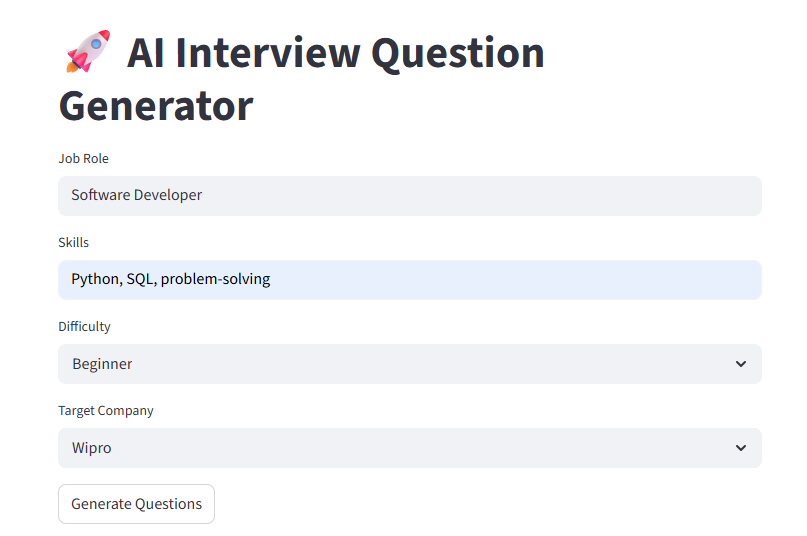

🚀 AI Interview Question Generator
An AI-powered Interview Question Generator built using Streamlit and Google Gemini API. This application generates customized interview questions based on the user's job role, skills, difficulty level, and target company.

🌟 Features
Generate interview questions using AI
Select job role and skills
Choose difficulty level:
 Beginner
 Intermediate
 Advanced
Company-specific question generation
 TCS
 Infosys
 Wipro
 Accenture
 Google
User-friendly Streamlit interface
Secure API key management using Streamlit Secrets

🛠️ Technologies Used
Python
Streamlit
Google Gemini API
Git & GitHub
Streamlit Cloud

📸 Application Preview

📂 Project Structure
AI-Interview-Question-Generator/
│
├── app.py
├── requirements.txt
├── .gitignore
├── README.md
└── .env (local only)

⚙️ Installation
Clone the repository:
git clone https://github.com/your-username/AI-Interview-Question-Generator.git
cd AI-Interview-Question-Generator

Install dependencies:
pip install -r requirements.txt

Create a .env file:
GEMINI_API_KEY=my_api_key

Run the application:
streamlit run app.py

☁️ Deployment
This project is deployed using Streamlit Cloud.
Live Demo:
https://ai-interview-question-generator-ckw3a5ia3vkrfavsp4ogdy.streamlit.app/

🎯 How It Works
Enter Job Role
Enter Skills
Select Difficulty Level
Select Target Company
Click Generate Questions
Receive AI-generated interview questions instantly

🔒 Security
API keys are not stored in the repository.
Secrets are managed using Streamlit Secrets and environment variables.
.env file is excluded using .gitignore.

📈 Future Enhancements
PDF Download
Answer Evaluation
Mock Interview Mode
Interview Score Analysis
Voice-Based Interview Practice
Additional Company Question Banks

👩‍💻 Author
Neha M
GitHub: https://github.com/neham21062005
⁠
⭐ If you found this project useful, please give it a star on GitHub!
